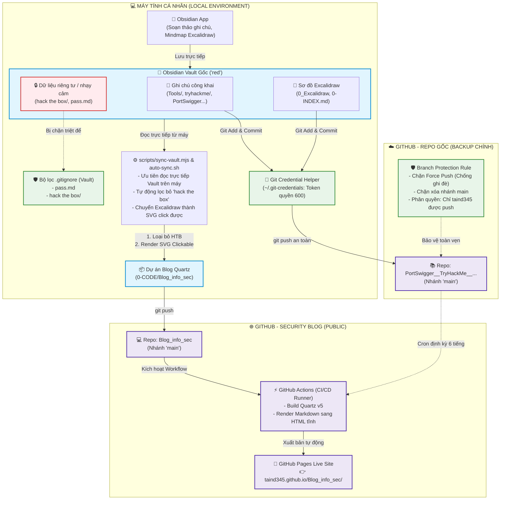

# 📘 Hướng Dẫn Vận Hành & Kiến Trúc Hệ Thống (Tài Liệu Nội Bộ)

Tài liệu hướng dẫn nội bộ về toàn bộ luồng dữ liệu, cơ chế kỹ thuật, cấu hình tự động hóa và cách vận hành hệ thống Security Blog giữa **Obsidian Vault gốc** và **Dự án Blog (Quartz v5)**.

---

## 🗺️ 1. Sơ Đồ Kiến Trúc & Luồng Dữ Liệu Tổng Thể



---

## 🛡️ 2. Hệ Thống Bảo Mật & Lọc Dữ Liệu 3 Lớp

| Lớp bảo vệ | Thành phần | Cơ chế hoạt động |
| :--- | :--- | :--- |
| **Lớp 1: Lọc tại Local** | `.gitignore` & `sync-vault.mjs` | Thư mục `hack the box/` và file `pass.md` bị chặn ngay từ Vault gốc. Ngoài ra, script `sync-vault.mjs` có danh sách `ignoredFolders` tự động phát hiện và xóa sổ thư mục này nếu nó lọt vào `content/` của blog. |
| **Lớp 2: Bảo vệ Token** | `Git Credential Helper` | GitHub Personal Access Token (PAT) không bị gán lộ trong `.git/config` mà được lưu tại `~/.git-credentials` với quyền `chmod 600`. Chỉ riêng user `ti` trên máy mới có quyền đọc. |
| **Lớp 3: Khóa nhánh GitHub** | `Branch Protection Rules` | Kích hoạt trên nhánh `main` của repo gốc. Chặn hoàn toàn lệnh `git push --force` và chặn xóa nhánh. Không ai có thể ghi đè lịch sử commit. Quyền push bị giới hạn độc quyền cho tài khoản `taind345`. |

---

## ⚙️ 3. Cơ Chế Xử Lý Sơ Đồ Excalidraw (`scripts/sync-vault.mjs`)

1. **Ưu tiên đọc Vault Local**:
   - Khi chạy trên máy bạn, script tự động phát hiện và đọc trực tiếp từ `/mnt/DATA_D/DESKTOP/DATA_DESKTOP/0_Obsidian notebook/red` (hoặc `/home/ti/Desktop/...`), giúp đồng bộ tức thì không cần mạng.
   - Khi chạy trên Cloud (GitHub Actions), script tự động fallback clone qua `REPO_URL` vào `.vault-cache`.
2. **Giải nén dữ liệu Excalidraw**:
   - File Excalidraw của Obsidian chứa JSON nén bằng `lz-string`. Script tự động trích xuất và giải mã JSON.
3. **Xử lý font Tiếng Việt có dấu (`DFVN-excalidraw`)**:
   - Font Virgil gốc thiếu ký tự tiếng Việt dẫn đến gãy nét chữ.
   - Script gán `font-family: 'DFVN-excalidraw', 'DFVN Excalifont', Virgil, cursive`.
   - Font WOFF2 (~72KB) được nạp offline từ `quartz/static/fonts/DFVN-Excalifont.woff2`.
4. **Tương tác liên kết (Interactive Clickable Links)**:
   - Mỗi node chứa link `[[tên-bài]]` hoặc URL được bọc trong thẻ `<a class="excalidraw-node-link">` để click chuyển bài mượt mà.
5. **Nhúng hình ảnh chụp màn hình (Embedded Screenshots)**:
   - Đọc mục `## Embedded Files` trong Excalidraw, map `fileId` sang file ảnh trong `0-asset/` và nhúng trực tiếp qua thẻ `<image href="...">`.
6. **Thẻ Markdown nhúng (`<!-- excalidraw-markdown-image:fileId -->`)**:
   - Biên dịch markdown thành card `<foreignObject>` trên canvas, đồng thời chèn nội dung chi tiết xuống cuối bài viết.

---

## 🚀 4. Tối Ưu Hiệu Năng Canvas (`quartz/components/scripts/excalidraw.inline.ts`)

- **Tăng tốc phần cứng 3D (GPU)**: Sử dụng `translate3d(x, y, 0) scale(...)` và `requestAnimationFrame`, đảm bảo tốc độ khung hình 60/120fps.
- **Kéo thả không giật lag (`.is-panning`)**: Khi bắt đầu kéo, tạm thời ngắt `pointer-events` trên các node con để triệt tiêu độ trễ hit-test.
- **Thu phóng mượt (Exponential Zoom)**: Sử dụng hàm số mũ `scale * Math.exp(delta * 0.0018)` giúp thao tác lăn chuột và pinch trackpad mượt mà như Figma.
- **Tự động căn giữa (Auto-fit)**: Căn giữa sơ đồ vừa vặn khung nhìn khi vừa mở trang hoặc khi nhấn nút reset ↺.

---

## 💻 5. Bảng Lệnh Điều Khiển Vận Hành

| Lệnh | Ý nghĩa |
| :--- | :--- |
| `npm run auto-sync` | **(Khuyên dùng)** Đồng bộ trọn gói: kéo vault, loại bỏ HTB, render Excalidraw sang SVG, commit và push lên GitHub |
| `npm run dev` / `npm run serve` | Chạy web server thử nghiệm cục bộ tại `http://localhost:8080` |
| `npm run build` | Biên dịch static site ra thư mục `public/` |

---

## 🛠️ 6. Xử Lý Sự Cố Thường Gặp (Troubleshooting)

- **Trang web chưa cập nhật bài viết mới**:
  - Chạy `npm run auto-sync` tại thư mục dự án `Blog_info_sec`.
  - Trên trình duyệt, nhấn **`Ctrl + F5`** (Windows/Linux) hoặc `Cmd + Shift + R` (Mac) để xóa bộ nhớ đệm cache.
- **Cổng 8080 bị chiếm dụng**:
  - Chạy `fuser -k 8080/tcp` để giải phóng port.
- **Token GitHub hết hạn (HTTP 401)**:
  - Tạo token mới tại `https://github.com/settings/tokens/new` (tích chọn quyền `repo`).
  - Cập nhật lại vào credential helper:
    ```bash
    echo "https://taind345:<TOKEN_MỚI>@github.com" > ~/.git-credentials
    ```
