# Huong dan Van hanh & Kien truc He thong Blog

Tai lieu huong dan noi bo ve toan bo luong du lieu, co che ky thuat, cau hinh tu dong hoa va cach van hanh he thong Security Blog.

---

## 1. Kien truc tong the

He thong hoat dong theo mo hinh GitOps va Static Site Generation (SSG) tach biet giua kho ghi chu va kho blog:

```mermaid
flowchart LR
    A["Obsidian Vault Goc\n(taind345/PortSwigger...)"] -->|"Git Push"| B["GitHub Source Repo"]
    B -->|"Auto-Sync / Cron 6h"| C["Script Chuyen Doi\n(scripts/sync-vault.mjs)"]
    C -->|"Generate Markdown + SVG"| D["Thu muc content/\n(Blog_info_sec)"]
    D -->|"Quartz v5 Engine"| E["Static HTML/CSS/JS\n(public/)"]
    E -->|"GitHub Actions"| F["GitHub Pages CDN\n(taind345.github.io/Blog_info_sec)"]
```



### Cac thanh phan chinh:
1. **Repo goc (Source Vault)**: `https://github.com/taind345/PortSwigger__TryHackMe__Writeup....etc-`  
   Noi luu tru bai viet, anh va so do tren ung dung Obsidian.
2. **Repo website (Blog Info Sec)**: `https://github.com/taind345/Blog_info_sec`  
   Ma nguon Quartz v5 da duoc tuy bien toi gian (giao dien Notion, font Cascadia Code, font Excalidraw tieng Viet, engine pan/zoom tang toc phan cung).
3. **Moi truong Hosting**: **GitHub Pages** (Mien phi, bang thong toan cau, SSL tu dong, uptime 99.9%).

---

## 2. Co che xu ly so do Excalidraw (`scripts/sync-vault.mjs`)

1. **Giai nen du lieu**:  
   File Excalidraw cua Obsidian chua JSON nen bang `lz-string`. Script tu dong trich xuat va giai ma JSON.
2. **Xu ly font Tieng Viet co dau (`DFVN-excalidraw`)**:  
   - Font Virgil goc thieu ky tu tieng Viet dan den gay net.
   - Script gan `font-family: 'DFVN-excalidraw', 'DFVN Excalifont', Virgil, cursive`.
   - Font WOFF2 (~72KB) duoc nap offline tu `quartz/static/fonts/DFVN-Excalifont.woff2`.
3. **Tuong tac lien ket (Interactive Clickable Links)**:  
   Moi node chua link `[[ten-bai]]` hoac URL duoc boc trong the `<a class="excalidraw-node-link">` de click chuyen bai.
4. **Nhung hinh anh chup man hinh (Embedded Screenshots)**:  
   Doc muc `## Embedded Files` trong Excalidraw, map `fileId` sang file anh trong `0-asset/` va nhung truc tiep qua the `<image href="...">`.
5. **The Markdown nhung (`<!-- excalidraw-markdown-image:fileId -->`)**:  
   Bien dich markdown thanh card `<foreignObject>` tren canvas, dong thoi chen noi dung chi tiet xuong cuoi bai viet.
6. **Deterministic Hashing (MD5)**:  
   ID phan tu so do duoc sinh tu `ex-` + `md5(duong-dan-file)`. Khi noi dung khong doi, ID khong doi, tranh tao commit rac trong Git.

---

## 3. Toi uu hieu nang Canvas (`excalidraw.inline.ts`)

- **Tang toc phan cung 3D (GPU)**: Su dung `translate3d(x, y, 0) scale(...)` va `requestAnimationFrame`, dam bao toc do 60/120fps.
- **Keo tha khong giat lag (`.is-panning`)**: Khi bat dau keo, tam thoi ngat `pointer-events` tren cac node con de triet tieu do tre hit-test.
- **Thu phong muot (Exponential Zoom)**: Su dung ham so mu `scale * Math.exp(delta * 0.0018)` giup thao tac lan chuot va pinch trackpad muot ma nhu Figma.
- **Tu dong can giua (Auto-fit)**: Can giua so do vua van khung nhin khi vua mo trang hoac khi nhan nut reset.

---

## 4. Quy trinh cap nhat & dong bo

### Cach 1: Chay 1 lenh tu may tinh
```bash
npm run auto-sync
```
Script se tu dong keo repo goc ve, chuyen doi, commit va day len GitHub neu co thay doi.

### Cach 2: Tu dong tren Cloud (Khong can mo may)
- **Dinh ky moi 6 tieng**: GitHub Actions tu dong chay luc 00:00, 06:00, 12:00, 18:00 UTC.
- **Nut bam thu cong**: Vao muc Actions tren GitHub repo Blog_info_sec, chon workflow "Deploy Quartz Blog to GitHub Pages" va bam "Run workflow".

---

## 5. Bang lenh dieu khien

| Lenh | Y nghia |
|---|---|
| `npm run auto-sync` | Dong bo tron goi tu repo goc, commit va push |
| `npm run dev` / `npm run serve` | Chay web server thu nghiem tai `http://localhost:8080` |
| `npm run build` | Bien dich static site ra thu muc `public/` |
| `npm run sync` | Chi keo repo goc va chuyen doi sang `content/` |

---

## 6. Xu ly su co thuong gap

- **Trinh duyet hien thi cache cu**: Nhan `Ctrl + F5` (Windows/Linux) hoac `Cmd + Shift + R` (Mac).
- **Port 8080 bi chiem**: Chay `fuser -k 8080/tcp` de giai phong port.
- **Doi URL repo goc**: Cap nhat bien `REPO_URL` tai dong 20 trong file `scripts/sync-vault.mjs`.
